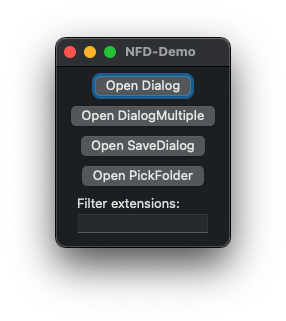

# Swift Native File Dialog

A thin Swift wrapper around the popular [mlabbe/nativefiledialog](https://github.com/mlabbe/nativefiledialog) library by Michael Labbe.

Native File Dialog is a tiny, neat C library that portably invokes native file open, folder select and save dialogs. Write dialog code once and have it pop up native dialogs on all supported platforms.  Avoid linking large dependencies like wxWidgets and qt.

### Features:

 - Zlib licensed.
 - Consistent UTF-8 support on all platforms.
 - Simple universal file filter syntax.
 - Multiple file selection support.
 - No third party dependencies for building or linking.
 - Support for Vista's modern `IFileDialog` on Windows.
 - Support for non-deprecated Cocoa APIs on OS X.
 - GTK3 dialog on Linux.
 - Tested, works alongside [SDL2](https://www.libsdl.org) on all platforms, for the game developers out there.

## Usage ##

### Single file dialog

```swift
// open single file dialog without filters
let result = NFD.OpenDialog()
    
switch result {
case let .success(path):
    if let path = path {
        // use path
    } else {
        // user canceled
    }
case let .failure(error):
    // an error has occured
}
```

### macOS Demo

You can find a macOS demo application in `/Apps/NFD-Demo/NFD-Demo.xcodeproj`




## File Filter Syntax

There is a form of file filtering in every file dialog API, but no consistent means of supporting it.  NFD provides support for filtering files by groups of extensions, providing its own descriptions (where applicable) for the extensions.

A wildcard filter is always added to every dialog.

#### Examples ####

`txt` The default filter is for text files.  There is a wildcard option in a dropdown.

`png,jpg;psd` The default filter is for png and jpg files.  A second filter is available for psd files.  There is a wildcard option in a dropdown.

`nil` Wildcard only.


# Copyright and Credit

Copyright &copy; 2014-2019 [Frogtoss Games](https://www.frogtoss.com), Inc.
File [LICENSE](LICENSE) covers all files in this repo.

Native File Dialog by Michael Labbe
<mike@frogtoss.com>

Tomasz Konojacki for [microutf8](https://puszcza.gnu.org.ua/software/microutf8/)

[Denis Kolodin](https://github.com/DenisKolodin) for mingw support.

[Tom Mason](https://github.com/wheybags) for Zenity support.

## Support ##

Directed support for this work is available from the original author under a paid agreement.

[Contact Frogtoss Games](https://www.frogtoss.com/pages/contact.html).


